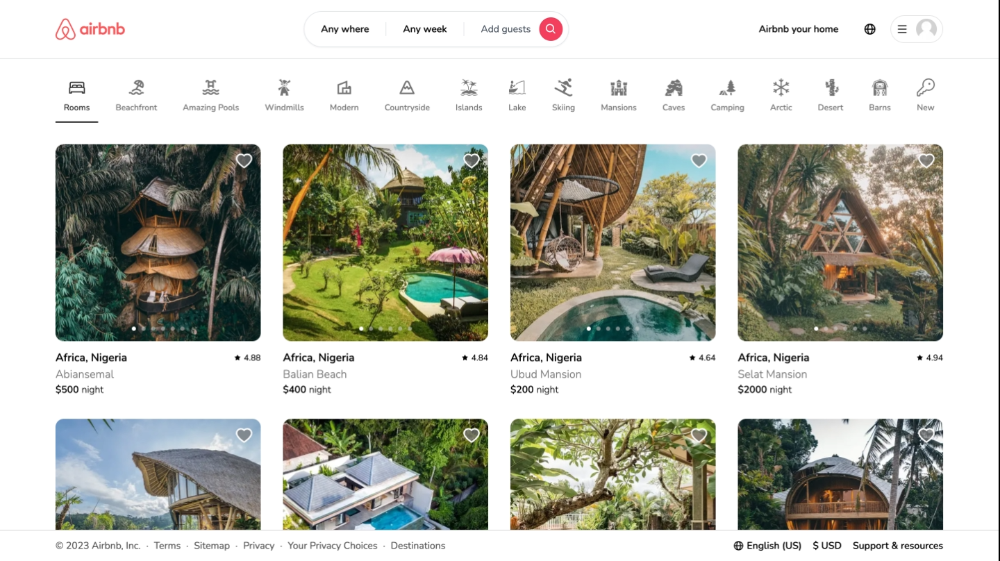

# Airbnb-Clone-Task
Cloned Airbnb landing page

Live Preview: [cynthia-airbnb-task](https://cynthia-airbnb-task.netlify.app)


## Screenshots


## Getting Started

First, install development dependencies:
```bash
npm install
# or
yarn 
```

Next, run the development server:

```bash
npm run dev
# or
yarn dev
```

Open [http://localhost:3000](http://localhost:3000) with your browser to see the result.
